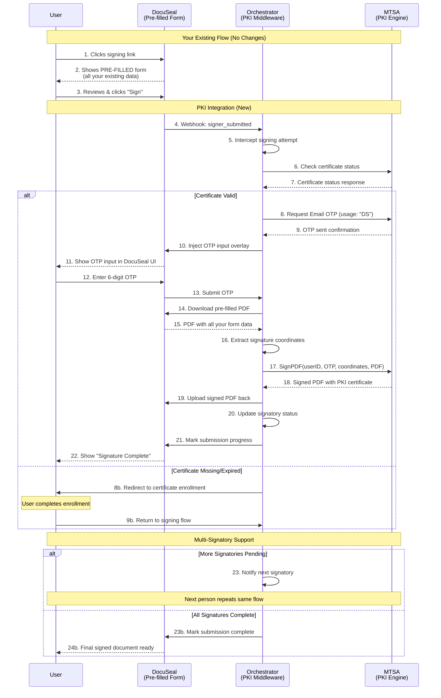
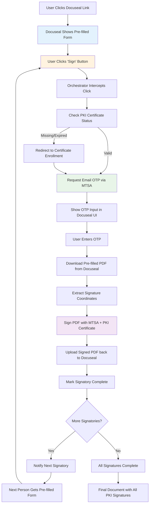

# 🔐 Docuseal + MTSA PKI Integration Plan
## Comprehensive Strategy for Trustgate Digital Certificate Integration

---

## 📋 **Executive Summary**

This document outlines a comprehensive integration strategy to replace Docuseal's native signing with MTSA (MyTrustSigner Agent) and Trustgate PKI infrastructure. The plan follows a **"PKI-Only Unified Workflow"** approach that uses MTSA for all document signing while leveraging Docuseal for document presentation, field placement, and workflow management.



## **🔧 Integration Summary**

### **Key Integration Points:**

| **Component** | **Role** | **Changes Required** |
|---------------|----------|---------------------|
| **DocuSeal** | Pre-filled form display | ✅ **NO CHANGES** - continues to work exactly as before |
| **Your Backend** | Form data preparation | ✅ **NO CHANGES** - all your `createSubmission()` logic stays the same |
| **Orchestrator** | PKI signing middleware | 🔧 **ENHANCED** - intercept signing, handle PKI workflow |
| **MTSA** | PKI certificate engine | ✅ **EXISTING** - already working with HTTP header auth |

### **What Stays the Same:**
- ✅ All your pre-filled fields (`principal_text`, `borrower_details`, etc.)
- ✅ User experience (click link → see form → click sign)
- ✅ Multi-signatory workflow timing (asynchronous signing)
- ✅ Docuseal notifications and UI
- ✅ Your existing `DocusealService` methods

### **What Changes:**
- 🔧 Webhook handler intercepts signing attempts
- 🔧 OTP input added to Docuseal interface
- 🔧 PKI certificates replace Docuseal's native signatures
- 🔧 Enhanced security and legal compliance

## 🏗️ **Current Architecture Analysis**

### **Existing Components**
- **Docuseal** (Port 3001) - Document signing UI and workflow management
- **Signing Orchestrator** (Port 4010) - Middleware service bridging Docuseal and MTSA
- **MTSA Container** (On-premises) - PKI certificate management and PDF signing via SOAP API
- **Backend API** - Loan/application signing initiation via `createLoanAgreementSigning()` and `createApplicationAgreementSigning()`
- **Webhook System** - Processes `signer_submitted` and `packet_completed` events

### **Integration Points Identified**
1. **Docuseal API Integration** - Leveraging submission webhooks and template management
2. **MTSA SOAP Interface** - Existing HTTP header authentication working
3. **Backend Services** - Enhanced to support PKI preferences and coordination
4. **Storage Management** - PDF processing and signed document handling

---

## 🎯 **Integration Strategy: PKI-Only Unified Workflow**

### **Core Principle**
Replace Docuseal's native signing entirely with MTSA PKI certificates while preserving Docuseal's strengths:
- **Single Workflow** - All signatures use MTSA PKI certificates exclusively
- **Docuseal as Presentation Layer** - Leverage UI, field placement, and document management
- **MTSA as Signing Engine** - Handle all cryptographic operations and certificate management
- **Seamless User Experience** - Users see familiar Docuseal interface but get PKI security
- **Future-Proof Architecture** - Single signing method, easier to maintain and enhance

---

## 📧 **PKI-Only Signing Journey (Form Pre-filled)**



### **Key Features - Seamless User Experience:**
- ✅ **Pre-filled Forms**: Users see familiar Docuseal interface with all fields populated
- ✅ **Single Click Signing**: Users only need to click "Sign" - no form filling required
- ✅ **PKI Behind Scenes**: All cryptographic operations handled by MTSA
- ✅ **Familiar UI**: Exact same Docuseal experience, just PKI-powered
- ✅ **Multi-Signatory Support**: Each person gets pre-filled form, signs with PKI

---

## ⏰ **Asynchronous Multi-Signatory Implementation**

### **Real-World Scenario Example (Your Existing Flow + PKI)**
```
Timeline Example - Loan Agreement with 3 Signatories:

📅 Monday 9:00 AM - Borrower
├── Borrower clicks Docuseal link (your existing flow)
├── Sees PRE-FILLED loan agreement (all fields populated by your system)
├── Reviews agreement, clicks "Sign" button
├── PKI process: OTP input → Signs with MTSA certificate
├── PDF now has 1 PKI signature
├── System notifies Company signatory

📅 Wednesday 2:30 PM (2 days later) - Company
├── Company signatory clicks their Docuseal link
├── Sees PRE-FILLED form + Borrower's PKI signature
├── Reviews agreement, clicks "Sign" button (no data entry needed)
├── PKI process: OTP input → Signs SAME PDF with company certificate
├── PDF now has 2 PKI signatures  
├── System notifies Witness

📅 Next Monday 11:15 AM (5 days later) - Witness
├── Witness clicks their Docuseal link
├── Sees PRE-FILLED form + both previous PKI signatures
├── Reviews agreement, clicks "Sign" button (minimal/no data entry)
├── PKI process: OTP input → Signs PDF with witness certificate
├── PDF now has ALL 3 PKI signatures
├── System marks submission as COMPLETE
```

**Key Point**: Your existing pre-filling logic in `DocusealService.createSubmission()` continues to work exactly as before - users just click "Sign" and get PKI security instead of Docuseal's native signatures.

### **Technical State Management**

**Session Persistence Across Time:**
```typescript
// Session persists across days/weeks
interface PersistentMultiSignatorySession {
  id: string;
  submissionId: string;
  createdAt: Date; // Could be weeks ago
  lastActivityAt: Date; // Last signatory action
  
  // Current state
  currentSignatoryIndex: number; // 0, 1, 2...
  awaitingSignatory: {
    uuid: string;
    email: string;
    role: string;
    notifiedAt: Date;
    remindersSent: number;
  };
  
  // Completed signatories
  completedSignatories: Array<{
    uuid: string;
    signedAt: Date; // Days/weeks apart
    certificateSerialNumber: string;
    ipAddress: string;
    userAgent: string;
  }>;
  
  // PDF evolution
  pdfVersions: Array<{
    version: number;
    signatoryCount: number;
    createdAt: Date;
    fileUrl: string;
    signatoryWhoSigned: string;
  }>;
  
  // Status tracking
  status: 'awaiting_signatory_1' | 'awaiting_signatory_2' | 'awaiting_signatory_3' | 'all_complete';
}

// Handle signatory at ANY time
async handleSignatoryAtAnyTime(payload: DocuSealWebhookPayload): Promise<void> {
  const submissionId = payload.data.id;
  
  // Get existing session (could be days/weeks old)
  let session = await this.getSessionBySubmissionId(submissionId);
  
  if (!session) {
    // First signatory starting the process
    session = await this.createNewMultiSignatorySession(payload);
  } else {
    // Subsequent signatory (could be days later)
    await this.updateSessionForCurrentSignatory(session, payload);
  }
  
  // Process current signatory independently
  await this.processSingleSignatory(session, payload);
}
```

### **PDF Version Management**
```typescript
class PDFVersionManager {
  async getCurrentPDFVersion(submissionId: string): Promise<PDFVersion> {
    const session = await this.getSession(submissionId);
    
    // Return the latest PDF version with all signatures so far
    const latestVersion = session.pdfVersions[session.pdfVersions.length - 1];
    
    return {
      url: latestVersion.fileUrl,
      version: latestVersion.version,
      signatureCount: latestVersion.signatoryCount,
      base64: await this.downloadPDFAsBase64(latestVersion.fileUrl)
    };
  }
  
  async addSignatureToPDF(
    currentPdfBase64: string, 
    signatory: SignatoryInfo, 
    otp: string
  ): Promise<string> {
    
    // Sign the PDF that may already have 0, 1, or 2 signatures
    const signedResult = await mtsaClient.signPDF({
      UserID: signatory.userId,
      FullName: signatory.fullName,
      AuthFactor: otp,
      SignatureInfo: {
        visibility: true,
        pageNo: signatory.signatureCoordinates.page + 1,
        x1: signatory.signatureCoordinates.x1,
        y1: signatory.signatureCoordinates.y1,
        x2: signatory.signatureCoordinates.x2,
        y2: signatory.signatureCoordinates.y2,
        pdfInBase64: currentPdfBase64 // PDF with existing signatures
      },
      FieldListToUpdate: [
        {
          pdfFieldName: `DateSigned_${signatory.role}`,
          pdfFieldValue: 'CURR_DATE,F=DD/MM/YYYY'
        },
        {
          pdfFieldName: `SignerName_${signatory.role}`,
          pdfFieldValue: 'SIGNER_FULLNAME'
        }
      ]
    });
    
    return signedResult.signedPdfInBase64; // Now has one more signature
  }
}
```

### **Notification & Reminder System**
```typescript
class AsyncSignatoryNotificationService {
  async notifyNextSignatory(session: PersistentMultiSignatorySession): Promise<void> {
    const nextSignatory = session.allSignatories[session.currentSignatoryIndex + 1];
    
    if (!nextSignatory) {
      // All done
      await this.finalizeSubmission(session);
      return;
    }
    
    // Send immediate notification
    await this.sendSigningNotification(nextSignatory, session);
    
    // Schedule reminders (in case they don't sign immediately)
    await this.scheduleReminders(nextSignatory, session);
  }
  
  async scheduleReminders(signatory: SignatoryInfo, session: PersistentMultiSignatorySession): Promise<void> {
    // Day 1: Immediate notification (already sent)
    // Day 3: First reminder
    // Day 7: Second reminder  
    // Day 14: Final reminder
    
    const reminderSchedule = [
      { days: 3, message: 'First Reminder: Document awaiting your signature' },
      { days: 7, message: 'Second Reminder: Please sign the pending document' },
      { days: 14, message: 'Final Reminder: Document signature required' }
    ];
    
    for (const reminder of reminderSchedule) {
      await this.scheduleDelayedNotification(
        signatory.email,
        reminder.message,
        reminder.days,
        session.id
      );
    }
  }
}
```

### **Resume & Recovery**
```typescript
class SessionRecoveryService {
  async resumeSigningSession(submissionId: string): Promise<SessionStatus> {
    const session = await this.getSessionBySubmissionId(submissionId);
    
    if (!session) {
      return { status: 'not_found', message: 'No signing session found' };
    }
    
    // Check if session is still valid (not expired)
    if (this.isSessionExpired(session)) {
      return { status: 'expired', message: 'Signing session has expired' };
    }
    
    // Determine current state
    switch (session.status) {
      case 'awaiting_signatory_1':
        return { 
          status: 'ready', 
          nextAction: 'await_first_signature',
          awaitingEmail: session.allSignatories[0].email
        };
        
      case 'awaiting_signatory_2':
        return { 
          status: 'ready', 
          nextAction: 'await_second_signature',
          awaitingEmail: session.allSignatories[1].email,
          completedCount: 1
        };
        
      case 'awaiting_signatory_3':
        return { 
          status: 'ready', 
          nextAction: 'await_final_signature',
          awaitingEmail: session.allSignatories[2].email,
          completedCount: 2
        };
        
      case 'all_complete':
        return { 
          status: 'completed', 
          message: 'All signatories have signed',
          finalPdfUrl: session.pdfVersions[session.pdfVersions.length - 1].fileUrl
        };
    }
  }
}
```

---

## 🔧 **Technical Implementation Plan**

### **Phase 1: PKI-Only Orchestrator Implementation**

#### **1.1 Complete Signing Interception**

**Core Strategy:** Intercept **all** Docuseal signing attempts and route through MTSA

**New Endpoints:**
```typescript
// PKI-only endpoints (no user choice needed)
POST /api/pki-intercept-signing // Intercept all Docuseal signing attempts
POST /api/pki-otp-request       // Request OTP for any signing
POST /api/pki-sign              // Complete PKI signing with OTP
GET  /api/pki-cert-status/:userId // Check certificate status
POST /api/pki-enroll            // Certificate enrollment for new users
```

**Multi-Signatory Webhook Override:**
```typescript
// Override ALL signing in handleSignerSubmitted - supports multiple signatories
async function handleSignerSubmitted(payload: DocuSealWebhookPayload, correlationId: string): Promise<void> {
  const log = createCorrelatedLogger(correlationId);
  
  log.info('Intercepting Docuseal signing for PKI processing', { 
    packetId: payload.data.packet_id,
    submissionId: payload.data.id,
    currentSignatory: payload.data.submitter_uuid
  });
  
  // Prevent Docuseal from completing THIS signatory's signature
  await preventDocusealNativeSigning(payload.data.id, payload.data.submitter_uuid);
  
  // Extract data for current signatory
  const signingData = await extractMultiSignatoryData(payload);
  
  // Determine signing order and current position
  const signingContext = await determineSigningContext(signingData);
  
  // Force PKI workflow for current signatory
  await initiatePKIWorkflowForSignatory(signingData, signingContext, correlationId);
}

// Enhanced data extraction for multi-signatory
async function extractMultiSignatoryData(payload: DocuSealWebhookPayload): Promise<MultiSignatoryData> {
  const submissionId = payload.data.id;
  const currentSubmitterUuid = payload.data.submitter_uuid;
  
  // Get full submission with all signatories
  const submissionResponse = await fetch(`${docusealApiUrl}/submissions/${submissionId}`, {
    headers: { 'X-Auth-Token': process.env.DOCUSEAL_API_TOKEN }
  });
  const submission = await submissionResponse.json();
  
  // Find current signatory
  const currentSubmitter = submission.submitters.find(s => s.uuid === currentSubmitterUuid);
  
  // Extract signature fields for THIS signatory only
  const currentSignatoryFields = submission.template.fields?.filter(field => 
    field.type === 'signature' && field.submitter_uuid === currentSubmitterUuid
  ) || [];
  
  return {
    submissionId,
    packetId: payload.data.packet_id,
    currentSubmitter: {
      uuid: currentSubmitterUuid,
      userId: currentSubmitter.metadata?.nric || currentSubmitter.metadata?.passport,
      fullName: currentSubmitter.name,
      email: currentSubmitter.email,
      role: currentSubmitter.role,
      signatureFields: currentSignatoryFields
    },
    allSubmitters: submission.submitters,
    template: submission.template,
    currentStatus: submission.status
  };
}
```

#### **1.2 PKI-Only Workflow Implementation**

**Complete Docuseal Integration:**
```typescript
// Prevent Docuseal from native signing and take full control
async function preventDocusealNativeSigning(submissionId: string): Promise<void> {
  // Option 1: Use Docuseal API to pause/hold the submission
  await fetch(`${docusealApiUrl}/submissions/${submissionId}`, {
    method: 'PUT',
    headers: { 'X-Auth-Token': process.env.DOCUSEAL_API_TOKEN },
    body: JSON.stringify({ 
      status: 'pending', // Prevent completion
      metadata: { pki_processing: true }
    })
  });
}

async function extractDocusealSigningData(payload: DocuSealWebhookPayload): Promise<DocusealSigningData> {
  const submissionId = payload.data.id;
  
  // Get full submission details via Docuseal API
  const submissionResponse = await fetch(`${docusealApiUrl}/submissions/${submissionId}`, {
    headers: { 'X-Auth-Token': process.env.DOCUSEAL_API_TOKEN }
  });
  const submission = await submissionResponse.json();
  
  // Extract signature fields and coordinates
  const signatureFields = submission.template.fields?.filter(field => field.type === 'signature') || [];
  
  // Get unsigned PDF URL
  const unsignedPdfUrl = `${docusealApiUrl}/submissions/${submissionId}/documents`;
  
  return {
    submissionId,
    packetId: payload.data.packet_id,
    userId: payload.data.signer_nric || payload.data.signer_id,
    fullName: payload.data.signer_name,
    email: payload.data.signer_email,
    signatureFields,
    unsignedPdfUrl,
    docusealSubmission: submission
  };
}
```

**Multi-Signatory Session Management:**
```typescript
interface MultiSignatoryPKISession {
  id: string;
  submissionId: string;
  packetId: string;
  
  // Current signatory details
  currentSignatory: {
    uuid: string;
    userId: string;
    fullName: string;
    email: string;
    role: string; // 'Borrower', 'Guarantor', 'Witness', etc.
    certificateStatus: 'checking' | 'valid' | 'expired' | 'not_found' | 'enrollment_required';
    otpRequested: boolean;
    otpTimestamp?: Date;
    signatureCoordinates: SignatureCoordinates[];
    status: 'intercepted' | 'cert_checked' | 'otp_sent' | 'ready_to_sign' | 'signed' | 'failed';
  };
  
  // Overall submission context
  allSignatories: Array<{
    uuid: string;
    userId: string;
    fullName: string;
    email: string;
    role: string;
    status: 'pending' | 'signed' | 'failed';
    signedAt?: Date;
    certificateSerialNumber?: string;
  }>;
  
  signingOrder: string[]; // Array of submitter UUIDs in signing order
  currentSignatoryIndex: number;
  totalSignatories: number;
  
  // PDF state management
  currentPdfUrl: string; // URL to current version (may have previous signatures)
  originalPdfUrl: string; // URL to original unsigned PDF
  
  // Session metadata
  submissionStatus: 'in_progress' | 'all_signed' | 'failed';
  createdAt: Date;
  expiresAt: Date;
}

// Multi-signatory PKI service
class MultiSignatoryPKIService {
  async initiateSignatoryWorkflow(
    multiSignatoryData: MultiSignatoryData, 
    signingContext: SigningContext
  ): Promise<MultiSignatoryPKISession> {
    
    // 1. Create or update session for this submission
    let session = await this.getExistingSession(multiSignatoryData.submissionId);
    
    if (!session) {
      // First signatory - create new session
      session = await this.createMultiSignatorySession(multiSignatoryData, signingContext);
    } else {
      // Subsequent signatory - update existing session
      session = await this.updateSessionForNextSignatory(session, multiSignatoryData.currentSubmitter);
    }
    
    // 2. Check certificate status for current signatory
    const certStatus = await this.checkCertificateStatus(session.currentSignatory.userId);
    session.currentSignatory.certificateStatus = certStatus.status;
    
    // 3. Handle based on certificate status
    if (certStatus.valid) {
      await this.requestOTPForSignatory(session.id);
      session.currentSignatory.otpRequested = true;
      session.currentSignatory.status = 'otp_sent';
    } else {
      session.currentSignatory.status = 'failed';
      await this.handleCertificateIssue(session.id, certStatus);
    }
    
    await this.saveSession(session);
    return session;
  }
  
  async completePKISigningForSignatory(sessionId: string, otp: string): Promise<SignatoryCompletionResult> {
    const session = await this.getSession(sessionId);
    
    // 1. Get current PDF version (may already have other signatures)
    const currentPdfBase64 = await this.downloadCurrentPDF(session);
    
    // 2. Sign PDF with MTSA for current signatory
    const signedResult = await this.signPDFWithMTSA(session, otp, currentPdfBase64);
    
    // 3. Update session with signature completion
    session.currentSignatory.status = 'signed';
    session.allSignatories[session.currentSignatoryIndex].status = 'signed';
    session.allSignatories[session.currentSignatoryIndex].signedAt = new Date();
    session.allSignatories[session.currentSignatoryIndex].certificateSerialNumber = signedResult.certificateSerialNumber;
    
    // 4. Upload new PDF version to Docuseal
    const newPdfUrl = await this.uploadSignedPDFVersion(session.submissionId, signedResult.signedPdfBase64);
    session.currentPdfUrl = newPdfUrl;
    
    // 5. Determine next steps
    const nextSignatoryIndex = session.currentSignatoryIndex + 1;
    
    if (nextSignatoryIndex >= session.totalSignatories) {
      // All signatories completed
      session.submissionStatus = 'all_signed';
      await this.completeFullSubmission(session);
      
      return {
        status: 'all_completed',
        message: 'All signatories have signed the document',
        nextAction: 'submission_complete'
      };
    } else {
      // More signatories pending
      session.currentSignatoryIndex = nextSignatoryIndex;
      await this.notifyNextSignatory(session);
      
      return {
        status: 'signatory_completed',
        message: `Signature ${nextSignatoryIndex} of ${session.totalSignatories} completed`,
        nextAction: 'await_next_signatory',
        nextSignatoryEmail: session.allSignatories[nextSignatoryIndex].email
      };
    }
    
    await this.saveSession(session);
  }

  // Critical: Handle PDF versions correctly for multiple signatures
  async downloadCurrentPDF(session: MultiSignatoryPKISession): Promise<string> {
    // If this is the first signatory, get original PDF
    if (session.currentSignatoryIndex === 0) {
      const response = await fetch(session.originalPdfUrl, {
        headers: { 'X-Auth-Token': process.env.DOCUSEAL_API_TOKEN }
      });
      const pdfBuffer = await response.arrayBuffer();
      return Buffer.from(pdfBuffer).toString('base64');
    } else {
      // Get PDF with previous signatures
      const response = await fetch(session.currentPdfUrl, {
        headers: { 'X-Auth-Token': process.env.DOCUSEAL_API_TOKEN }
      });
      const pdfBuffer = await response.arrayBuffer();
      return Buffer.from(pdfBuffer).toString('base64');
    }
  }

  // Enhanced MTSA signing for multi-signatory
  async signPDFWithMTSA(
    session: MultiSignatoryPKISession, 
    otp: string, 
    pdfBase64: string
  ): Promise<MTSASigningResult> {
    
    const currentSig = session.currentSignatory;
    
    // Convert coordinates for current signatory
    const signatureInfo = {
      visibility: true,
      pageNo: currentSig.signatureCoordinates[0].page + 1,
      x1: Math.round(currentSig.signatureCoordinates[0].x * PDF_WIDTH),
      y1: Math.round(currentSig.signatureCoordinates[0].y * PDF_HEIGHT),
      x2: Math.round((currentSig.signatureCoordinates[0].x + currentSig.signatureCoordinates[0].width) * PDF_WIDTH),
      y2: Math.round((currentSig.signatureCoordinates[0].y + currentSig.signatureCoordinates[0].height) * PDF_HEIGHT),
      pdfInBase64: pdfBase64
    };
    
    // Auto-populate fields specific to this signatory
    const fieldListToUpdate = [
      {
        pdfFieldName: `DateSigned_${currentSig.role}`,
        pdfFieldValue: 'CURR_DATE,F=DD/MM/YYYY'
      },
      {
        pdfFieldName: `SignerName_${currentSig.role}`,
        pdfFieldValue: 'SIGNER_FULLNAME'
      },
      {
        pdfFieldName: `SignerID_${currentSig.role}`,
        pdfFieldValue: 'SIGNER_ID'
      }
    ];
    
    // Call MTSA to add this signatory's signature to the PDF
    const result = await mtsaClient.signPDF({
      UserID: currentSig.userId,
      FullName: currentSig.fullName,
      AuthFactor: otp,
      SignatureInfo: signatureInfo,
      FieldListToUpdate: fieldListToUpdate
    });
    
    return {
      success: result.statusCode === '000',
      signedPdfBase64: result.signedPdfInBase64,
      certificate: result.userCert,
      certificateSerialNumber: this.extractSerialNumber(result.userCert),
      statusCode: result.statusCode,
      message: result.statusMsg
    };
  }
}
```

### **Phase 2: Integration with Your Existing Docuseal Flow**

#### **2.1 Preserve Your Existing Pre-filling Logic**

**No Changes Needed to Your Form Logic:**
```typescript
// Your existing DocusealService.createSubmission() stays EXACTLY the same
// All your pre-filling continues to work:

const companyFields: SubmitterField[] = [
  {
    name: 'principal_text',
    default_value: `${this.convertToMalaysianWordsNoCurrency(applicationData.principalAmount)}`,
    readonly: true
  },
  {
    name: 'borrower_details', 
    default_value: `${(applicationData.user.fullName || 'N/A').toUpperCase()}\nIC NO: ${applicationData.user.icNumber || 'N/A'}`,
    readonly: true
  },
  // ... all your existing 15+ pre-filled fields continue to work
];

// Your existing submission creation stays the same:
const submission = await this.createSubmission({
  template_id: process.env.DOCUSEAL_LOAN_AGREEMENT_TEMPLATE_ID || '',
  send_email: true,
  external_id: `loan_${loanId}`,
  submitters: [
    {
      name: 'Kredit.my Sdn Bhd',
      email: process.env.COMPANY_SIGNING_EMAIL || 'admin@kredit.my', 
      role: 'Company',
      fields: companyFields // All your pre-filled data
    },
    {
      name: applicationData.user.fullName || 'Borrower',
      email: applicationData.user.email,
      role: 'Borrower',
      fields: borrowerFields // Pre-filled borrower data
    },
    {
      name: process.env.WITNESS_NAME || 'Legal Representative',
      email: process.env.WITNESS_EMAIL || 'legal@kredit.my',
      role: 'Witness'
    }
  ]
});
```

#### **2.2 Only Change: Replace Signature Action with PKI**

**Single Integration Point - Webhook Enhancement:**
```typescript
// Your existing webhook at /api/docuseal/webhook gets enhanced
router.post('/webhook', async (req, res) => {
  try {
    console.log('DocuSeal webhook:', req.body);
    
    // NEW: Check if this is a signing attempt (not form completion)
    if (req.body.event_type === 'signer_submitted') {
      // Intercept for PKI signing instead of letting Docuseal complete
      await handlePKISigningInterception(req.body);
    } else {
      // Keep your existing webhook handling for other events
      await docusealService.handleWebhook(req.body);
    }
    
    return res.json({ success: true });
  } catch (error) {
    // Your existing error handling
  }
});

async function handlePKISigningInterception(payload: any): Promise<void> {
  // 1. Extract signatory info from your existing Docuseal submission
  const submissionId = payload.data.id;
  const currentRole = payload.data.submitter_role; // 'Company', 'Borrower', 'Witness'
  const userNric = payload.data.submitter_nric || payload.data.submitter_id;
  
  // 2. Prevent Docuseal from completing the signature
  await preventDocusealNativeCompletion(submissionId, currentRole);
  
  // 3. Download the pre-filled PDF (with all your data already in it)
  const prefilledPdfBase64 = await downloadPrefilledPDF(submissionId);
  
  // 4. Start PKI signing process for this specific signatory
  await initiatePKIForSignatory({
    submissionId,
    role: currentRole,
    userNric,
    prefilledPdfBase64,
    signatureCoordinates: extractSignatureCoordinates(payload)
  });
}
```

Based on the [Docuseal API documentation](https://www.docuseal.com/docs/api), we'll enhance templates with PKI metadata:

**Template Enhancement:**
```javascript
// Add PKI metadata to Docuseal templates
const enhancedTemplate = {
  ...existingTemplate,
  preferences: {
    pki_signing_enabled: true,
    signature_methods: ['standard', 'pki'],
    default_signing_method: 'standard'
  },
  // Custom fields for PKI tracking
  fields: [
    ...existingFields,
    {
      name: 'signing_method_preference',
      type: 'select',
      options: ['Standard Signature', 'Digital Certificate (PKI)'],
      required: false,
      default_value: 'Standard Signature'
    }
  ]
};
```

**Submission Enhancement:**
```javascript
// Enhanced submission creation with PKI support
const createPKIEnabledSubmission = async (templateId, submitters) => {
  return await fetch(`${docusealApiUrl}/submissions`, {
    method: 'POST',
    headers: {
      'X-Auth-Token': process.env.DOCUSEAL_API_TOKEN,
      'Content-Type': 'application/json'
    },
    body: JSON.stringify({
      template_id: templateId,
      submitters: submitters.map(submitter => ({
        ...submitter,
        // Add PKI preference metadata
        metadata: {
          pki_enabled: true,
          certificate_check_required: true,
          signing_method: submitter.preferred_signing_method || 'standard'
        }
      })),
      // Enhanced webhook URL to include PKI parameters
      webhook_url: `${orchestratorUrl}/webhooks/docuseal?pki_enabled=true`
    })
  });
};
```

#### **2.2 Webhook Enhancement for PKI Detection**

**Enhanced Webhook Processing:**
```typescript
// Enhanced webhook handler using Docuseal API data
async function handleSignerSubmitted(payload: DocuSealWebhookPayload, correlationId: string): Promise<void> {
  const { data } = payload;
  
  // Extract PKI preference from submitter metadata
  const submitter = data.submitters?.[0];
  const pkiSigningRequested = submitter?.metadata?.signing_method === 'pki' || 
                              submitter?.metadata?.pki_enabled === true;
  
  if (pkiSigningRequested) {
    // Extract signature field coordinates from Docuseal webhook
    const signatureFields = data.template?.fields?.filter(field => field.type === 'signature');
    const coordinates = signatureFields?.map(field => ({
      page: field.areas[0]?.page || 0,
      x: field.areas[0]?.x || 0,
      y: field.areas[0]?.y || 0,
      width: field.areas[0]?.w || 100,
      height: field.areas[0]?.h || 50
    }));
    
    // Initiate PKI signing workflow
    await initiatePKISigningWorkflow({
      packetId: data.packet_id,
      userId: data.signer_nric || data.signer_id,
      coordinates,
      pdfUrl: data.unsigned_pdf_url,
      submissionId: data.id
    }, correlationId);
  } else {
    // Continue with standard Docuseal flow
    await processStandardSigning(payload, correlationId);
  }
}
```

### **Phase 3: Frontend Integration**

#### **3.1 Docuseal Template JavaScript Enhancement**

**PKI Signing Interface Injection:**
```html
<!-- Inject into Docuseal templates -->
<script>
(function() {
  'use strict';
  
  // PKI Signing Enhancement for Docuseal
  const PKISigningManager = {
    init() {
      this.addPKISigningOption();
      this.addOTPModal();
      this.bindEvents();
    },
    
    addPKISigningOption() {
      // Add PKI signing button alongside standard signing
      const signButton = document.querySelector('[data-action="sign"]');
      if (signButton) {
        const pkiButton = document.createElement('button');
        pkiButton.innerHTML = '🔐 Sign with Digital Certificate';
        pkiButton.className = 'btn btn-outline-primary pki-sign-btn';
        pkiButton.onclick = () => this.initiatePKISigning();
        signButton.parentNode.insertBefore(pkiButton, signButton.nextSibling);
      }
    },
    
    async initiatePKISigning() {
      try {
        // Check certificate status
        const certStatus = await this.checkCertificateStatus();
        
        if (certStatus.valid) {
          // Request OTP
          await this.requestOTP();
          this.showOTPModal();
        } else {
          alert('Certificate not found or expired. Please contact support for certificate enrollment.');
        }
      } catch (error) {
        console.error('PKI signing initiation failed:', error);
        alert('Failed to initiate PKI signing. Please try again.');
      }
    },
    
    async checkCertificateStatus() {
      const response = await fetch('/api/pki-check-cert', {
        method: 'POST',
        headers: { 'Content-Type': 'application/json' },
        body: JSON.stringify({ 
          userId: this.getUserId(),
          submissionId: this.getSubmissionId()
        })
      });
      return await response.json();
    },
    
    async requestOTP() {
      const response = await fetch('/api/pki-otp-request', {
        method: 'POST',
        headers: { 'Content-Type': 'application/json' },
        body: JSON.stringify({
          userId: this.getUserId(),
          submissionId: this.getSubmissionId()
        })
      });
      return await response.json();
    },
    
    showOTPModal() {
      // Create and show OTP input modal
      const modal = document.createElement('div');
      modal.className = 'pki-otp-modal';
      modal.innerHTML = `
        <div class="modal-overlay">
          <div class="modal-content">
            <h3>🔐 Digital Certificate Signing</h3>
            <p>An OTP has been sent to your registered email address.</p>
            <input type="text" id="pki-otp-input" placeholder="Enter OTP" maxlength="6">
            <div class="modal-buttons">
              <button onclick="PKISigningManager.completePKISigning()">Complete Signing</button>
              <button onclick="PKISigningManager.closePKIModal()">Cancel</button>
            </div>
          </div>
        </div>
      `;
      document.body.appendChild(modal);
    },
    
    async completePKISigning() {
      const otp = document.getElementById('pki-otp-input').value;
      if (!otp) {
        alert('Please enter the OTP');
        return;
      }
      
      try {
        const response = await fetch('/api/pki-sign', {
          method: 'POST',
          headers: { 'Content-Type': 'application/json' },
          body: JSON.stringify({
            sessionId: this.getSessionId(),
            otp: otp,
            submissionId: this.getSubmissionId()
          })
        });
        
        const result = await response.json();
        if (result.success) {
          this.closePKIModal();
          alert('Document signed successfully with digital certificate!');
          // Refresh the page to show signed document
          window.location.reload();
        } else {
          alert(`Signing failed: ${result.message}`);
        }
      } catch (error) {
        console.error('PKI signing completion failed:', error);
        alert('Failed to complete PKI signing. Please try again.');
      }
    }
  };
  
  // Initialize when DOM is ready
  if (document.readyState === 'loading') {
    document.addEventListener('DOMContentLoaded', () => PKISigningManager.init());
  } else {
    PKISigningManager.init();
  }
})();
</script>

<style>
.pki-otp-modal {
  position: fixed;
  top: 0;
  left: 0;
  width: 100%;
  height: 100%;
  z-index: 10000;
}

.modal-overlay {
  background: rgba(0,0,0,0.5);
  width: 100%;
  height: 100%;
  display: flex;
  align-items: center;
  justify-content: center;
}

.modal-content {
  background: white;
  padding: 2rem;
  border-radius: 8px;
  max-width: 400px;
  width: 90%;
  text-align: center;
}

.pki-sign-btn {
  margin-left: 10px;
  background: linear-gradient(135deg, #667eea 0%, #764ba2 100%);
  color: white;
  border: none;
  padding: 10px 20px;
  border-radius: 5px;
  cursor: pointer;
}
</style>
```

#### **3.2 Backend Docuseal Service Enhancement**

```typescript
// Enhanced DocusealService with PKI support
class EnhancedDocusealService extends DocusealService {
  async createPKIEnabledLoanSigning(loanId: string, pkiPreferred: boolean = false): Promise<{
    submission: DocuSealSubmission;
    signUrl: string;
    pkiEnabled: boolean;
  }> {
    // Get loan and user data
    const loan = await prisma.loan.findUnique({
      where: { id: loanId },
      include: { user: true }
    });

    if (!loan) throw new Error('Loan not found');

    // Create enhanced submitter data with PKI preferences
    const submitters = [{
      name: loan.user.fullName,
      email: loan.user.emailAddress,
      role: 'Borrower',
      metadata: {
        pki_enabled: true,
        preferred_signing_method: pkiPreferred ? 'pki' : 'standard',
        user_id: loan.user.nric || loan.user.passportNumber,
        certificate_check_required: true
      },
      fields: [
        // Standard fields
        ...this.getStandardLoanFields(loan),
        // PKI preference field
        {
          name: 'signing_method_preference',
          default_value: pkiPreferred ? 'Digital Certificate (PKI)' : 'Standard Signature',
          readonly: false
        }
      ]
    }];

    // Create submission with enhanced template
    const submission = await this.createSubmission({
      template_id: process.env.LOAN_AGREEMENT_TEMPLATE_ID!,
      submitters,
      // Enhanced webhook URL
      webhook_url: `${process.env.SIGNING_ORCHESTRATOR_URL}/webhooks/docuseal?pki_enabled=true&loan_id=${loanId}`,
      external_id: `loan_${loanId}`,
      completed_redirect_url: `${process.env.FRONTEND_URL}/dashboard/loans/${loanId}/signed`,
      expired_redirect_url: `${process.env.FRONTEND_URL}/dashboard/loans/${loanId}/expired`
    });

    return {
      submission,
      signUrl: submission.submitters[0]?.sign_url || '',
      pkiEnabled: true
    };
  }
}
```

### **Phase 4: Advanced Features & Optimization**

#### **4.1 Direct Frontend PKI Signing Page** (Optional)

For users who prefer a dedicated PKI signing interface:

```typescript
// New route: /dashboard/loans/[id]/pki-sign
export default function PKISigningPage({ loanId }: { loanId: string }) {
  const [certificateStatus, setCertificateStatus] = useState<'checking' | 'valid' | 'invalid' | 'expired'>('checking');
  const [otpSent, setOtpSent] = useState(false);
  const [otp, setOtp] = useState('');
  const [pdfData, setPdfData] = useState<string>('');
  const [signatureCoordinates, setSignatureCoordinates] = useState<{x: number, y: number}>({x: 0, y: 0});

  return (
    <div className="pki-signing-interface">
      <div className="certificate-status">
        {certificateStatus === 'checking' && <CertificateCheckingUI />}
        {certificateStatus === 'valid' && <ValidCertificateUI />}
        {certificateStatus === 'invalid' && <InvalidCertificateUI />}
      </div>
      
      {certificateStatus === 'valid' && (
        <div className="signing-workflow">
          <PDFPreviewWithSignaturePlacement 
            pdfData={pdfData}
            onCoordinateSelect={setSignatureCoordinates}
          />
          
          {!otpSent ? (
            <OTPRequestButton onClick={handleOTPRequest} />
          ) : (
            <OTPInputAndSignButton 
              otp={otp}
              onChange={setOtp}
              onSign={handlePKISigning}
            />
          )}
        </div>
      )}
    </div>
  );
}
```

#### **4.2 Enhanced Monitoring & Analytics**

```typescript
// PKI Signing Analytics
interface PKISigningMetrics {
  total_pki_signings: number;
  success_rate: number;
  average_signing_time: number;
  otp_failure_rate: number;
  certificate_expiry_warnings: number;
  most_common_errors: Array<{error: string, count: number}>;
}

// Enhanced admin dashboard with PKI metrics
class PKIAnalyticsService {
  async getPKISigningMetrics(dateRange: DateRange): Promise<PKISigningMetrics> {
    // Query PKI signing sessions and generate metrics
  }
  
  async getCertificateExpiryWarnings(): Promise<CertificateExpiryWarning[]> {
    // Check certificates nearing expiry
  }
}
```

---

## 🔒 **Security & Compliance Implementation**

### **Enhanced Security Measures**

1. **OTP Session Security**
   ```typescript
   interface SecureOTPSession {
     id: string;
     userId: string;
     expiresAt: Date; // 10-minute expiry
     attemptCount: number; // Max 3 attempts
     ipAddress: string;
     userAgent: string;
     isUsed: boolean;
   }
   ```

2. **Certificate Validation**
   ```typescript
   async function validateCertificateForSigning(userId: string): Promise<CertificateValidationResult> {
     const certInfo = await mtsaClient.getCertInfo({ UserID: userId });
     
     return {
       isValid: certInfo.certStatus === 'Valid',
       expiryDate: new Date(certInfo.certValidTo),
       daysUntilExpiry: calculateDaysUntilExpiry(certInfo.certValidTo),
       requiresRenewal: shouldRenewCertificate(certInfo.certValidTo),
       trustLevel: determineTrustLevel(certInfo)
     };
   }
   ```

3. **Audit Logging**
   ```typescript
   interface PKIAuditLog {
     timestamp: Date;
     userId: string;
     action: 'otp_request' | 'certificate_check' | 'signing_attempt' | 'signing_success' | 'signing_failure';
     documentId: string;
     ipAddress: string;
     userAgent: string;
     result: 'success' | 'failure';
     errorMessage?: string;
     certificateSerialNumber?: string;
   }
   ```

---

## 📊 **Implementation Timeline & Phases**

### **Phase 1: Foundation (Week 1-2)**
- [ ] Enhance signing orchestrator with PKI endpoints
- [ ] Implement OTP session management
- [ ] Add certificate status checking
- [ ] Test MTSA integration with coordinate mapping

### **Phase 2: Docuseal Integration (Week 3-4)**
- [ ] Enhance webhook processing for PKI detection
- [ ] Implement PDF upload back to Docuseal after signing
- [ ] Add PKI metadata to template creation
- [ ] Test end-to-end PKI workflow

### **Phase 3: Frontend Enhancement (Week 5-6)**
- [ ] Inject PKI signing options into Docuseal templates
- [ ] Implement OTP input interface
- [ ] Add certificate status indicators
- [ ] User preference management

### **Phase 4: Advanced Features (Week 7-8)**
- [ ] Direct PKI signing page (optional)
- [ ] Enhanced analytics and monitoring
- [ ] Bulk signing capabilities
- [ ] Admin dashboard enhancements

---

## 🧪 **Testing Strategy**

### **Integration Testing**
1. **MTSA Connection Tests**
   - Certificate status checking
   - OTP request and validation
   - PDF signing with various coordinate sets
   - Error handling and retry logic

2. **Docuseal Workflow Tests**
   - Standard signing (ensure no regression)
   - PKI signing option detection
   - Webhook payload processing
   - Signed PDF upload verification

3. **End-to-End Tests**
   - Complete user journey from loan approval to PKI signing
   - Certificate enrollment flow
   - Error scenarios and fallback handling

### **Performance Testing**
- OTP request/response times
- PDF conversion and signing performance
- Concurrent signing sessions
- Database query optimization

---

## 🚀 **Deployment Strategy**

### **Environment Configuration**
```bash
# Enhanced environment variables for PKI integration
MTSA_PKI_ENABLED=true
MTSA_SOAP_USERNAME=your_username
MTSA_SOAP_PASSWORD=your_password
MTSA_ENVIRONMENT=pilot # or prod

# Docuseal API integration
DOCUSEAL_API_TOKEN=your_api_token
DOCUSEAL_BASE_URL=https://sign.kredit.my:3001
DOCUSEAL_WEBHOOK_SECRET=your_webhook_secret

# PKI session management
PKI_SESSION_EXPIRY_MINUTES=10
PKI_OTP_MAX_ATTEMPTS=3
PKI_CERTIFICATE_RENEWAL_WARNING_DAYS=30
```

### **Deployment Steps**
1. **Deploy Enhanced Orchestrator** (Zero downtime)
2. **Update Backend APIs** (Backward compatible)
3. **Deploy Frontend Enhancements** (Progressive enhancement)
4. **Configure Docuseal Templates** (Gradual rollout)

---

## 📈 **Success Metrics**

### **Technical KPIs**
- PKI signing success rate: >95%
- OTP delivery time: <30 seconds
- Signing completion time: <5 minutes
- System uptime: >99.5%

### **Business KPIs**
- User adoption rate of PKI signing
- Reduction in document signing disputes
- Improved compliance scores
- Enhanced customer satisfaction

### **Security KPIs**
- Zero security incidents
- Certificate compliance rate: 100%
- Audit log completeness: 100%

---

## 🔗 **API Reference & Integration Points**

### **MTSA API Specification**

#### **Service Configuration**
- **Service Type:** SOAP (WSDL)
- **Request Format:** `application/xml`
- **Authentication:** HTTP Headers (already implemented ✅)
  - **Pilot:** `opg_capital_pilot` / `YcuLxvMMcXWPLRaW`
  - **Production:** `opg_capital` / `QgNwHw2Q5RvdhfRY`
- **Endpoints:**
  - **Pilot:** `<DOMAIN:PORT>/MTSAPilot/MyTrustSignerAgentWSAPv2?wsdl`
  - **Production:** `<DOMAIN:PORT>/MTSA/MyTrustSignerAgentWSAPv2?wsdl`

#### **1. RequestEmailOTP Method**

**Purpose:** Generate Email OTP for PKI signing authentication

**Input Parameters:**
| Field | Type | Required | Description |
|-------|------|----------|-------------|
| `UserID` | String | Yes | Malaysian NRIC (12 digits, no dashes) or Passport |
| `OTPUsage` | String | Yes | `"DS"` = digital signing, `"NU"` = new cert enrollment |
| `EmailAddress` | String | Conditional | Required for enrollment, optional for DS if cert exists |

**Response Parameters:**
| Field | Type | Description |
|-------|------|-------------|
| `statusCode` | String | `"000"` = success, other codes indicate errors |
| `statusMsg` | String | Human-readable status description |

**Example Implementation:**
```typescript
// Enhanced OTP request for PKI signing
async requestPKISigningOTP(userId: string, email?: string): Promise<OTPResponse> {
  const otpRequest = {
    UserID: userId.replace(/[-\s]/g, ''), // Remove dashes/spaces
    OTPUsage: 'DS', // Digital Signing
    EmailAddress: email // Optional for existing cert holders
  };
  
  const result = await mtsaClient.requestEmailOTP(otpRequest, correlationId);
  
  return {
    success: result.statusCode === '000',
    message: result.statusMsg,
    otpSent: result.statusCode === '000'
  };
}
```

#### **2. SignPDF Method**

**Purpose:** Sign PDF document with PKI certificate using OTP authentication

**Input Parameters:**
| Field | Type | Required | Description |
|-------|------|----------|-------------|
| `UserID` | String | Yes | NRIC (12 digits) or Passport number |
| `FullName` | String(100) | Yes | Full name as per MyKad/Passport |
| `AuthFactor` | String(6) | Yes | Email OTP (6 digits for UserType 1) |
| `SignatureInfo` | Object | Yes | Signature placement and visibility details |
| `FieldListToUpdate` | Array | Yes | PDF form fields to auto-fill (can be empty) |

**SignatureInfo Object:**
| Field | Type | Required | Description |
|-------|------|----------|-------------|
| `visibility` | Boolean | Yes | `true` for visible, `false` for invisible signature |
| `pageNo` | Integer | If visible | Page number for signature placement (1-based) |
| `x1, y1, x2, y2` | Integer | If visible | Rectangle coordinates for signature |
| `pdfInBase64` | String | Yes | PDF document encoded as Base64 |
| `sigImageInBase64` | String | Optional | Custom signature image (Base64) |

**PdfFieldNameValue Object:**
| Field | Type | Required | Description |
|-------|------|----------|-------------|
| `pdfFieldName` | String | Yes | PDF form field name |
| `pdfFieldValue` | String | Yes | Field value or template (`CURR_DATE`, `SIGNER_FULLNAME`, `SIGNER_ID`) |

**Response Parameters:**
| Field | Type | Description |
|-------|------|-------------|
| `statusCode` | String | `"000"` = success, see status codes below |
| `statusMsg` | String | Human-readable message |
| `signedPdfInBase64` | String | Signed PDF document (Base64 encoded) |
| `userCert` | String | Signer's certificate (Base64 X.509) |

**Enhanced Implementation:**
```typescript
// Enhanced PDF signing with coordinate mapping from Docuseal
async signPDFWithPKI(request: PKISigningRequest): Promise<PKISigningResponse> {
  // Convert Docuseal coordinates to MTSA format
  const signatureInfo = {
    visibility: true,
    pageNo: request.coordinates.page + 1, // Convert 0-based to 1-based
    x1: Math.round(request.coordinates.x * request.pdfWidth),
    y1: Math.round(request.coordinates.y * request.pdfHeight),
    x2: Math.round((request.coordinates.x + request.coordinates.width) * request.pdfWidth),
    y2: Math.round((request.coordinates.y + request.coordinates.height) * request.pdfHeight),
    pdfInBase64: request.pdfBase64,
    sigImageInBase64: request.signatureImage // Optional custom signature
  };

  // Auto-fill standard loan agreement fields
  const fieldListToUpdate = [
    {
      pdfFieldName: 'DateSigned',
      pdfFieldValue: 'CURR_DATE,F=DD/MM/YYYY'
    },
    {
      pdfFieldName: 'SignerName',
      pdfFieldValue: 'SIGNER_FULLNAME'
    },
    {
      pdfFieldName: 'SignerID',
      pdfFieldValue: 'SIGNER_ID'
    },
    ...request.customFields
  ];

  const signRequest = {
    UserID: request.userId.replace(/[-\s]/g, ''),
    FullName: request.fullName,
    AuthFactor: request.otp,
    SignatureInfo: signatureInfo,
    FieldListToUpdate: fieldListToUpdate
  };

  const result = await mtsaClient.signPDF(signRequest, correlationId);

  return {
    success: result.statusCode === '000',
    message: result.statusMsg,
    signedPdfBase64: result.signedPdfInBase64,
    certificate: result.userCert,
    statusCode: result.statusCode
  };
}
```

#### **MTSA Status Codes Reference**

| Code | Description | Action Required |
|------|-------------|-----------------|
| `000` | Success | Continue workflow |
| `DS101` | Missing required parameter | Validate input data |
| `DS102` | Failed to read user cert | Check certificate enrollment |
| `DS103` | Expired certificate | Trigger certificate renewal |
| `DS104` | Revoked certificate | Block signing, contact admin |
| `DS107` | Invalid PDF field | Validate field names exist |
| `DS120` | Signature embedding error | Retry with different coordinates |
| `DS135` | Timestamp authority error | Retry after delay |
| `WS10x/WS11x` | Web service errors | Check authentication/connection |

#### **Enhanced Coordinate Mapping**

```typescript
// Convert Docuseal field coordinates to MTSA rectangle coordinates
function mapDocusealToMTSACoordinates(
  docusealField: DocusealFieldArea,
  pdfDimensions: { width: number; height: number }
): MTSASignatureCoordinates {
  // Docuseal provides normalized coordinates (0-1), MTSA expects pixels
  const x1 = Math.round(docusealField.x * pdfDimensions.width);
  const y1 = Math.round(docusealField.y * pdfDimensions.height);
  const x2 = Math.round((docusealField.x + docusealField.w) * pdfDimensions.width);
  const y2 = Math.round((docusealField.y + docusealField.h) * pdfDimensions.height);

  return {
    pageNo: docusealField.page + 1, // Convert 0-based to 1-based
    x1,
    y1,
    x2,
    y2,
    visibility: true
  };
}
```

### **Docuseal API Endpoints Used**
Based on the [Docuseal API documentation](https://www.docuseal.com/docs/api):

- `POST /submissions` - Create enhanced submissions with PKI metadata
- `GET /submissions/{id}` - Monitor signing progress
- `POST /submissions/pdf` - Upload signed PDFs back to Docuseal
- `PUT /submissions/{id}` - Update submission status
- Webhook endpoints for `signer_submitted` and `packet_completed` events

### **Integration Workflow Confirmation**

Our plan is **100% valid** with the MTSA specification. The workflow becomes:

1. **User Chooses PKI Signing** → Extract coordinates from Docuseal field placement
2. **Request OTP** → `RequestEmailOTP(UserID, "DS", EmailAddress)`
3. **User Enters OTP** → Validate OTP format (6 digits)
4. **Sign PDF** → `SignPDF(UserID, FullName, OTP, SignatureInfo, FieldList)`
5. **Upload Signed PDF** → Upload `signedPdfInBase64` back to Docuseal
6. **Complete Workflow** → Update submission status

The existing MTSA client with HTTP header authentication is **perfect** for this integration! 🎯

---

## 🎯 **Conclusion**

This comprehensive integration plan provides a **seamless, secure, and scalable** approach to integrating Trustgate PKI digital certificates with your existing Docuseal workflow. The hybrid override mode ensures:

✅ **Minimal Disruption** - Existing workflows continue unchanged  
✅ **Enhanced Security** - PKI certificates provide non-repudiation  
✅ **User Choice** - Flexible signing method selection  
✅ **Future-Ready** - Extensible architecture for additional features  
✅ **Compliance** - Meets Malaysian digital signature standards  

The modular implementation approach allows for incremental rollout, thorough testing, and continuous improvement while maintaining system stability and user satisfaction.

---

*This plan leverages your existing robust infrastructure including the working MTSA SOAP integration, Docuseal API capabilities, and established signing orchestrator to create a world-class PKI signing solution.*
